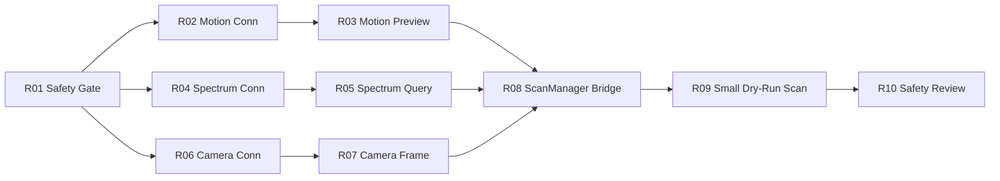

# Real Device Integration — Sprint 计划

> R01–R10 为规划 Sprint。**当前禁止自动开始实施。** 每项合并前须完成 `safety_boundary.md` 评审。

---

## Sprint R01 — 真实设备安全边界和开关

**目标**：统一 `SafetyGate`、环境变量契约、商业 UI Real 模式 banner 占位（disabled）。

**禁止**：任何真实命令发送、ScanManager 接入。

**测试**：
- `test_integration_safety` 全 PASS
- 新增 gate 单测：未启用 env 时 `check_motion_command` 拒绝

**回滚**：删除 gate 扩展，恢复 v0.5 行为。

---

## Sprint R02 — 运动平台 connection-only

**目标**：Real motion **仅连接/断开/identity 查询**，不 home/move。

**禁止**：G-code、jog、home。

**测试**：
- Mock 模式回归 QA PASS
- connection-only 集成测试（fake serial / loopback）

**回滚**：`RealMotionAdapter`  Feature flag 关闭。

---

## Sprint R03 — 运动平台 dry-run command preview

**目标**：home/move 命令生成 **preview 日志 + UI 确认**，仍不默认发送。

**禁止**：无确认自动发送、无限位校验发送。

**测试**：
- dry-run preview 单测
- QA 确认 commercial safety PASS

**回滚**：禁用 preview 入口，保留 R02 connection-only。

---

## Sprint R04 — 频谱仪 connection-only

**目标**：VISA 连接、`*IDN?`、断连，错误隔离。

**禁止**：长时 trace 采集阻塞 UI、修改 CSV 格式。

**测试**：
- discovery 单测不污染 commercial QA
- legacy UI VISA 线程异常不影响 commercial shell

**回滚**：移除 commercial 对 VISA 的任何 import。

---

## Sprint R05 — 频谱仪 query mock-to-real adapter

**目标**：单点/短 trace 查询适配，结果归一化为现有 mock trace 结构。

**禁止**：扫描流程联动、写生产 CSV。

**测试**：
- adapter 单测 + normalized payload 契约
- commercial bottom dock 仍用 mock 默认

**回滚**：adapter 注册表清空，回 Mock trace。

---

## Sprint R06 — 相机 connection-only

**目标**：枚举设备、连接状态、分辨率查询。

**禁止**：连续采集、阻塞 UI 线程。

**测试**：Mock 相机路径回归 PASS。

**回滚**：移除 real camera import。

---

## Sprint R07 — 相机 frame capture adapter

**目标**：单帧采集 → 与 mock snapshot 相同目录约定。

**禁止**：自动扫描联动、修改 report 模板。

**测试**：PNG 输出路径单测；commercial 拍照按钮 dual-path。

**回滚**：拍照按钮回 mock-only。

---

## Sprint R08 — ScanManager 接口桥接

**目标**：定义 **商业 UI ↔ ScanManager** 桥接接口（只读状态 + 事件），不跑真实 grid scan。

**禁止**：商业 shell 默认实例化 ScanManager、修改 CSV。

**测试**：
- static safety：`commercial_shell_no_scan_manager` 仍 PASS 或显式 gated
- 桥接层 mock 单测

**回滚**：删除桥接 module，v0.5 QA 全 PASS。

---

## Sprint R09 — 真实扫描小范围 dry-run

**目标**：2×2 或更小 grid，**dry-run 轨迹 + mock 频谱**，Real motion 可选 preview。

**禁止**：生产 scale 扫描、无评审启用 Real。

**测试**：
- 小范围集成测试
- 完整 commercial QA + 新 real-dry-run QA

**回滚**：feature flag 关闭 R09 入口。

---

## Sprint R10 — 真实扫描安全评审

**目标**：端到端评审、操作手册、急停/限位验证、冻结 Real MVP 版本。

**禁止**：未经评审合并 main。

**测试**：
- 人工验收 checklist
- 全量 unittest + commercial QA + safety audit

**回滚**：tag `real-device-mvp` 撤回，main 保持 Mock-only tag。

---

## 依赖关系

## 与 Commercial Demo v0.5 的关系

- v0.5 tag `commercial-demo-v0.5` **永久保留 Mock 演示基线**
- Real Sprint 在 main 上增量开发，每项可 feature-flag 回退到 v0.5 行为
- **禁止**在 v0.5 冻结 tag 上直接打 Real 功能 patch
